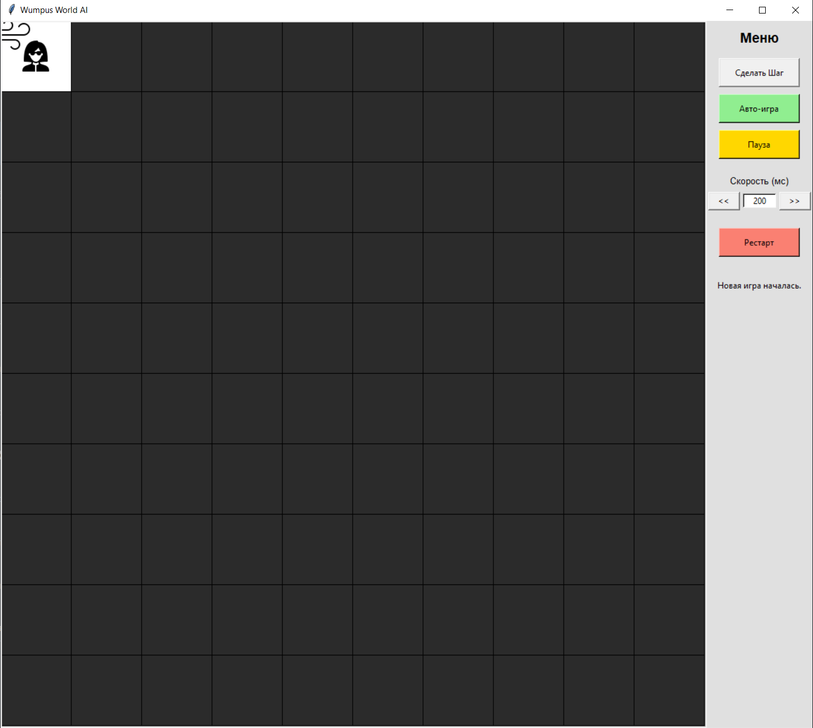
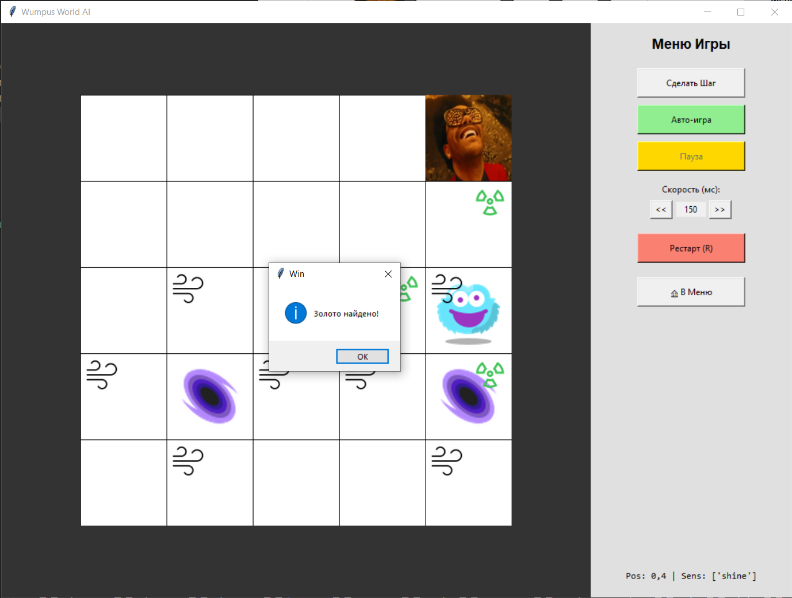

# Wumpus World: Knowledge-Based Agent

   

Реализация классической задачи искусственного интеллекта «Мир Вампуса» (Wumpus World). Агент исследует пещеру, избегает ловушек и охотится за золотом, используя пропозициональную логику и метод резолюций для принятия решений.

## 📸 Скриншоты

### 🎮 Игровой процесс

Агент исследует карту, открывая «туман войны». Интерфейс отображает показания сенсоров (Ветер, Вонь).



### 🏆 Победа (и мемы)

Как только золото найдено, агент празднует победу.



## 🧠 Как это работает?

В основе агента лежит символный ИИ. Он не гадает на нейросетях, а математически доказывает безопасность клеток.

1. **База знаний (Knowledge Base)**
   - Факты и правила хранятся в виде булевых формул с использованием SymPy.
   - Пример фактов: `~Pit_0_0` (в клетке (0,0) нет ямы), `Wind_0_1` (в клетке (0,1) ощущается ветер).
   - Пример правил: `Wind_x_y <=> (Pit_neighbor_1 | Pit_neighbor_2 | ...)`
2. **Логический вывод (Inference)**
   - Перед каждым ходом агент использует SAT-solver и доказательство от противного.
   - Если гипотеза «в клетке (X, Y) есть яма» приводит к противоречию с наблюдениями (например, «ветер отсутствует»), клетка помечается как `SAFE`.
3. **Стратегия исследования**
   - *Exploration*: приоритет новым безопасным клеткам.
   - *Backtracking*: переход к ранее посещённым безопасным клеткам, если новых нет.
   - *Risk Management*: «Panic Mode» рассчитывает риски и выбирает вынужденный шаг, когда безопасных ходов не осталось.

## 🚀 Установка и запуск

Проект использует современный менеджер пакетов `uv`.
   - Если у вас он не установлен, его можно скачать и установить отсюда:
   - 👉 https://docs.astral.sh/uv/getting-started/installation/

### Вариант 1. Запуск из исходников

```bash
git clone https://github.com/Toksyanich/WumpusWorld.git
cd WumpusWorld
uv sync
uv run python grafics.py
```

### Вариант 2. Готовый .exe (Windows)

1. Скачайте архив из раздела Releases.
2. Распакуйте и запустите `WumpusWorld.exe`.
3. Python устанавливать не нужно.

## 🎛 Управление

- `Авто-игра`: агент играет самостоятельно.
- `Сделать шаг`: ручной режим для отладки и демонстрации логики.
- `Пауза`: остановка и возобновление авто-игры.
- `Скорость (<< >>)`: задержка между ходами от 50 мс до 2000 мс.
- `Рестарт`: генерация нового мира.

## 🗂 Структура проекта

- `main.py` — ядро. Содержит классы `Agent` (логика на SymPy) и `WumpusWorld` (генерация мира).
- `grafics.py` — интерфейс (Tkinter), отвечает за отрисовку, анимацию и управление.
- `icons/` — набор спрайтов.

## 👤 Автор

Михаил  
Проект выполнен в рамках курса «Системы искусственного интеллекта».

## 🛠 Сборка проекта в .exe

Если вам нужно самостоятельно собрать исполняемый файл, используйте PyInstaller через uv:

```bash
uv run pyinstaller --noconsole --onefile --add-data "icons;icons" --name WumpusGame grafics.py
```

